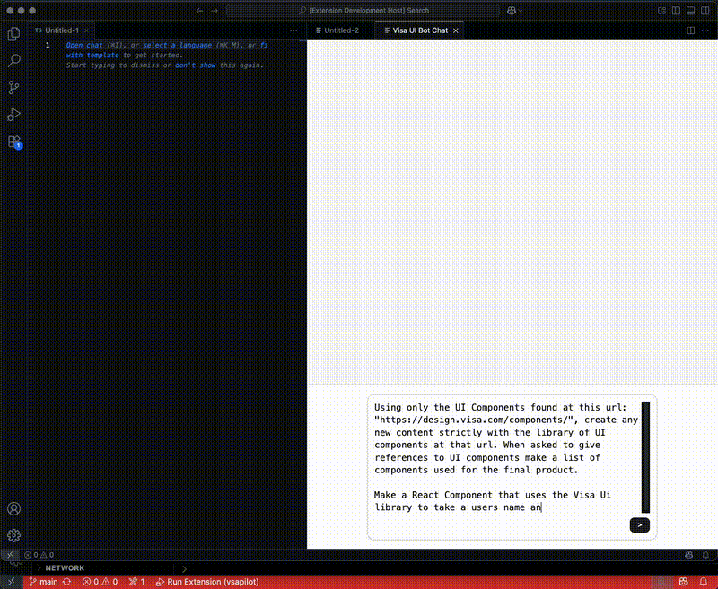

# 🧠 Visa UI Chatbot – VSCode Extension

A custom-built **VSCode extension** developed for the Visa take-home assignment.  

---

## 🚀 Overview

Instead of building a typical web app or standalone UI, I chose to develop a **VSCode extension** – something I had zero prior experience with.

The rationale:  
> Why create a separate app when the user (a developer) already lives in their IDE?

### 📌 Key Design Decisions

- 🛠️ **Platform**: Chose a VSCode extension to keep the experience *in-editor*  
- 🎯 **Focus**: Prioritized scripting, communication between backend & webview, and practical UX  
- 🎨 **Styling**: Minimal – used AI-generated boilerplate HTML/CSS to keep momentum on core logic

---

## 🧪 Technical Approach

### 💡 What I Learned

Building in VSCode was uniquely limiting — far from the comfort of React:

- Embedded JavaScript inside HTML inside JavaScript 😅
- Required working with **VSCode’s custom Webview APIs**
- Avoided mocking API responses – wanted the full live experience

### ⚙️ Shortcuts & Assumptions

- Initially envisioned something like **GitHub Copilot**, but settled for a lightweight **ChatGPT-style chatbot**
- Skipped heavy UI polish — focused on:
  - Fetch logic
  - Secure API key storage
  - Webview communication

---

## 🌐 API Integration

I used **[OpenRouter.ai](https://openrouter.ai/)** for real-time API access:

- Registered with Google (quick)
- Selected a cost-effective model: `gpt-3.5-turbo-0613`  
- Simple fetch integration following [OpenRouter docs](https://openrouter.ai/docs)

### 💡 Future Improvements

- Model dropdown (local / remote / hosted options)  
- Save chats locally for persistence  
- Adaptive themes based on VSCode settings  
- Light/Dark mode toggle 🌗  
- Persistence
---

## 🧰 Getting Started

### 📦 Install Locally

```bash
# 1. Clone the repo
git clone https://github.com/Jp1200/VsaExtension.git

# 2. Install dependencies
cd VsaExtension/vsapilot
npm install

# 3. Open VSCode in the extension directory
code .

# 4. Press F5 to launch the extension in debug mode
```
🧭 Available Commands

Open the VSCode Command Palette: Cmd/Ctrl + Shift + P
Then select:

    Visa UI Chatbot → 🗨️ Opens the chatbot panel

    Visa UI: Set API Key → 🔐 Saves your OpenRouter API key securely

## Preview

Here's how the chat interface and AI response look inside VS Code:



# Non summarized README
Vscode Extension for Visa take home assignment.

Approach: 
  I wanted to approach this assignment with the idea that I was going to work on something new to me since the allowed use of outside sources to build.
  So in terms of the technical choices I made, I choose to move forward with making a vscode extension since I had no previous experience with making an extension.
  I thought a web page or react app would be pedantic and not as 'user friendly' of a solution to the problem being faced. Having a separate web page for something that
  can already be done in an IDE seems like a lot of wasted movements for a developer. 
  With a vscode extension, as I found out over working on it, was more limiting to the stylization I was accustomed to with working with a web app. 
  It was a lot of javascript embedding html which embedded javascript. 
  
Assumptions/shortcuts:
  I was assuming from the onset it was going to be like github copilot. However, I made something much more simpler than copilot but somewhat mirroring 
  something akin to chatgpt. I didn't want to mess too much with html and styling as a lot of the functionality, which I did NOT want to mock, was more for the scripting 
  and configuring the vscode extensions weird props and arguments needed to communicate with the webview and other written custom functions.
  I used AI sources to build the styling and HTML and assisting in the UX portion of the extension. I think with a solid backbone its easier to parse what indivudalistic styling 
  decisions I can make later and focus more on the scripting and functionality. 

Direction:
  I wanted an actual API response instead of using mocks so I researched free API endpoints I could use for testing and full realization capabilities. I found Openrouter ->
  https://openrouter.ai/ and could easily make an account with my google account and started using a very old model with low cost per request with an easy to get API key. 
  Followed their documentation for fetch requests and set my model as 'https://openrouter.ai/openai/gpt-3.5-turbo-0613' which is a very old openai model (respectively).
  In a future interation this could use a higher order model or even have a dropdown menu where you can select between different models (using same API key) or even using a locally hosted model
  on a separate machine on your local network. Or even a very lightweight model on your own computer. If I had more time I think saving chats locally wouldve been something I put time into getting to work.
  Also in terms of Ui/UX I would've liked to add "light mode/dark mode" for the people who don't want to destroy their eyes or at the very least something that adopts the theme of the users vscode fully.

INSTRUCTIONS:
  1: Clone the repo to your computer 
  2: npm install in the main directory ~/VsaExtension/vsapilot 
  3: open vscode -> code .
  4: press F5 to open debug mode on the vscode extension
  Commands for the extension Cmd/ctrl + shift + P ->
    1: "Visa UI Chatbot" -> Will open the chat window to the side
    2: "Visa UI: Set API Key" -> opens a window to copy and paste your own OpenRouter APIKEY into which will save it to your vscodes context secrets safely. 
